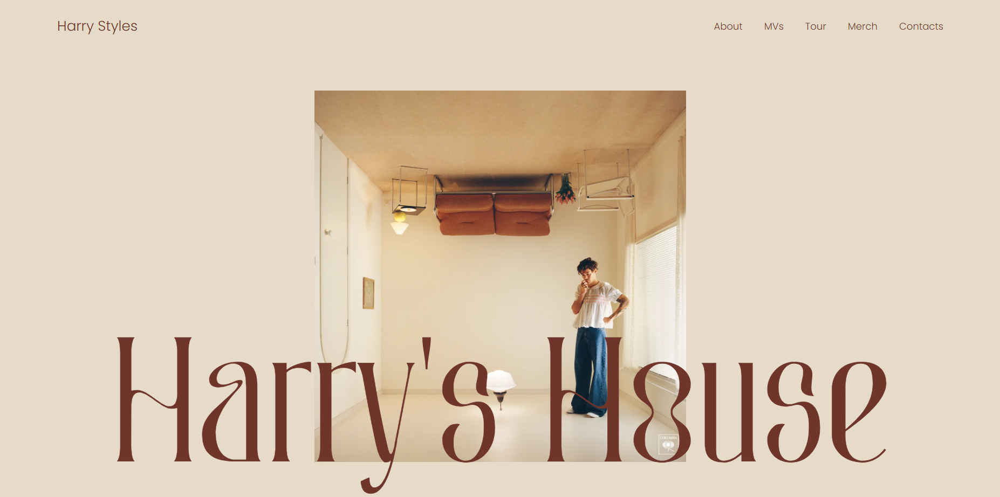

# Harry's House 

Projeto de uma **landing page interativa** inspirada no álbum *Harry's House* do cantor Harry Styles. A proposta é criar uma experiência visual moderna e responsiva, destacando elementos gráficos, informações e carrosséis de conteúdo relacionados ao artista e seu trabalho.

## Preview

## Funcionalidades

- Design responsivo com CSS customizado
- Carrossel com videoclipes e álbuns
- Layout otimizado para mobile e desktop
- Paleta de cores personalizada baseada na estética do álbum

## Tecnologias utilizadas

- [React.js](https://reactjs.org/)
- [Vite](https://vitejs.dev/)
- HTML5 + CSS3 (customizados, sem frameworks)
- JavaScript (ES6+)
- [React Router DOM](https://reactrouter.com/) (se usado)

